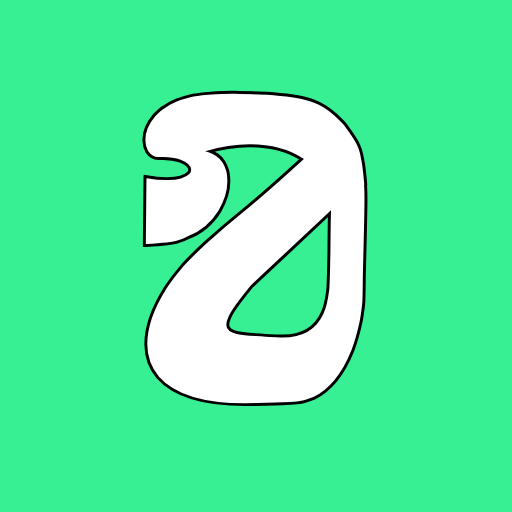
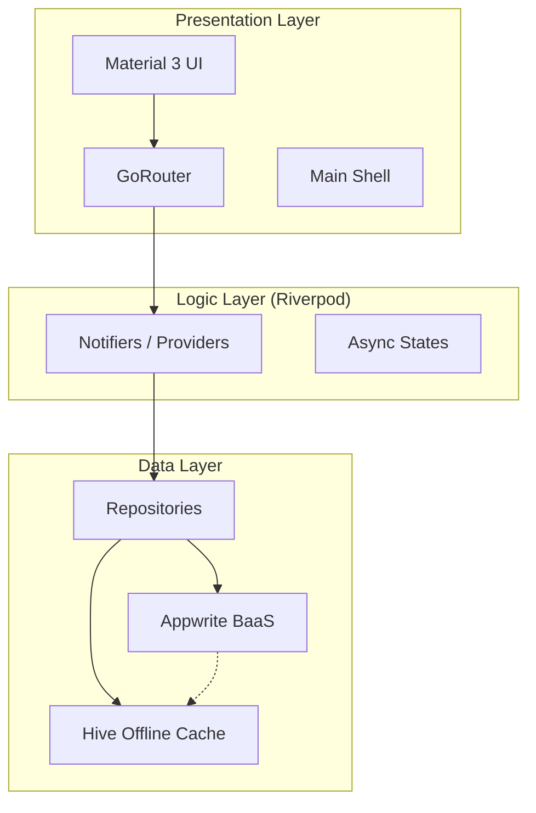

<p align="center">
  
</p>

<h1 align="center">Olitun — Learn Anything, Anywhere, Even Offline</h1>

<p align="center">
  <em>A beautifully crafted, offline-first learning platform for Ol Chiki (Santali Script) built with Flutter.</em>
</p>

<p align="center">
  
  
  
  
  
  
</p>

<p align="center">
  
</p>

---

## 🌟 Why Olitun?

- **Preserving Culture:** The first premium platform dedicated to the Ol Chiki script.
- **Offline First:** Learn anywhere, even without an internet connection, thanks to Hive persistence.
- **Gamified Mastery:** Earn stars, track streaks, and advance through levels with interactive quizzes.

---

## ✨ Features

<table border="0">
  <tr>
    <td width="50%">
      <h3>📚 Lessons & Content</h3>
      <p>Progressive alphabet, numbers, words, and sentence lessons with dual-script display (Ol Chiki + Latin transliteration).</p>
      
    </td>
    <td width="50%">
      <h3>🎮 Interactive Quizzes</h3>
      <p>Multiple-choice quizzes with animated feedback, scoring, and mastery levels to keep you engaged.</p>
      
    </td>
  </tr>
  <tr>
    <td width="50%">
      <h3>📈 Progress Tracking</h3>
      <p>Streaks, stars, learning time, and cloud sync ensures your progress is never lost across devices.</p>
      
    </td>
    <td width="50%">
      <h3>🛠️ Admin CMS</h3>
      <p>Full content management dashboard for educators to update lessons, letters, and quizzes in real-time.</p>
      
    </td>
  </tr>
</table>

---

## 🏗️ Architecture Overview



---

## 🚀 Quick Start

### Prerequisites
- Flutter SDK `^3.24.0`
- An [Appwrite](https://appwrite.io/) project

### Setup
```bash
# Clone the repository
git clone https://github.com/Kh3rwa1/olitunapp.git
cd olitunapp

# Install dependencies
flutter pub get

# Generate code (Riverpod)
dart run build_runner build
```

### Run
```bash
flutter run \
  --dart-define=APPWRITE_ENDPOINT=https://sgp.cloud.appwrite.io/v1 \
  --dart-define=APPWRITE_PROJECT_ID=<your-project-id> \
  --dart-define=ADMIN_TEAM_ID=admins \
  --dart-define=TRANSLATE_URL=<appwrite-function-execution-url> \
  --dart-define=SENTRY_DSN=<your-sentry-dsn>
```

The app will refuse to boot if `APPWRITE_ENDPOINT` or `APPWRITE_PROJECT_ID`
is missing — there are no hardcoded fallbacks. Admin access is granted by
membership in the Appwrite Team named by `ADMIN_TEAM_ID` (default `admins`);
see [SECURITY.md](SECURITY.md) for the full model.

### Provisioning Appwrite (one-time)

Set `APPWRITE_API_KEY` to a server key with `databases.write`, `collections.write`,
`teams.write`, and `buckets.write` scopes, then run:

```bash
node scripts/appwrite_setup.mjs
```

This script is idempotent (existing resources return `409` and are skipped) and
creates:
- the `olitun_db` database, every content collection, and the
  `translation_cache` / `rate_limits` collections used by the translator function,
- the storage buckets, and
- the admin team whose **team ID** matches `ADMIN_TEAM_ID` (default `admins`).
  Override via `ADMIN_TEAM_ID=<id> node scripts/appwrite_setup.mjs`.

Then deploy the translator function (see
[`functions/translator/README.md`](functions/translator/README.md) and
[`admin-panel/README.md`](admin-panel/README.md)) and pass its execution URL to
the Flutter build via `--dart-define=TRANSLATE_URL=…`.

### Managing admins

Admin access is purely team membership — there is no client-side secret.

1. Open the **Appwrite Console** → **Auth** → **Teams** → select the team whose
   ID matches `ADMIN_TEAM_ID` (default `admins`).
2. **Add an admin:** click **Add member**, enter the user's email. They must
   already have an Appwrite account; once accepted they can sign in at
   `/admin/login` in the Flutter app.
3. **Remove an admin:** open the team, find the member, click **Remove**.
   The next call to `Teams.list()` from their session will return without the
   admin team and the `/admin/*` router guard will bounce them to login.
4. **Rotating the admin team:** create a new team in the Console, rebuild the
   app with `--dart-define=ADMIN_TEAM_ID=<new-team-id>`, and delete the old
   team. The match is on the immutable team ID, never the name, so renaming a
   team does not grant or revoke access.

---

## 🛠️ Tech Stack

| Component | Technology |
|-----------|------------|
| **Frontend** | [Flutter](https://flutter.dev/) (Material 3) |
| **State** | [Riverpod](https://riverpod.dev/) |
| **BaaS** | [Appwrite](https://appwrite.io/) |
| **Offline DB** | [Hive](https://docs.hivedb.dev/) |
| **Navigation** | [GoRouter](https://pub.dev/packages/go_router) |
| **Charts** | [FL Chart](https://pub.dev/packages/fl_chart) |
| **Animations** | [Lottie](https://pub.dev/packages/lottie) & [Flutter Animate](https://pub.dev/packages/flutter_animate) |

---

## 📁 Project Structure

```bash
lib/
├── core/              # Theme, Auth, API, Layout, Config
├── features/          # Feature-first modules (Admin, Home, Lessons, Profile)
├── shared/            # Reusable Models, Providers, and Widgets
└── main.dart          # App Entry & Router
```

---

## 🤝 Contributing

We welcome contributions! Please see our [CONTRIBUTING.md](CONTRIBUTING.md) for guidelines.

---

## 🗺️ Roadmap

Track our progress and upcoming features on our [Public Project Board](https://github.com/users/Kh3rwa1/projects/1).

---

## 📄 License

This project is licensed under the MIT License - see the [LICENSE](LICENSE) file for details.

---

<p align="center">
  <b>Johar! ᱡᱚᱦᱟᱨ!</b> 🙏
</p>
