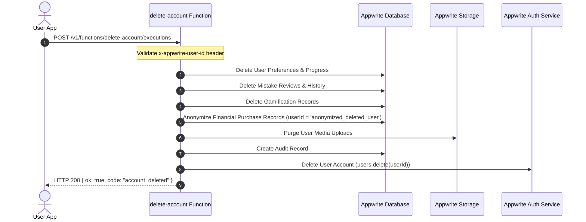

# Account Deletion & Privacy Architecture

This document describes Olitun's data deletion, anonymization, and privacy preservation policies implemented in `functions/delete-account/`.

---

## 1. Deletion Workflow Lifecycle

---

## 2. Data Lifecycle & Retention Rules

| Data Category | Handling Strategy | Retention Rationale |
|---|---|---|
| **User Profile & Credentials** | Permanently Deleted | Data Minimization (GDPR Art. 17) |
| **Learning & Mistake History** | Permanently Deleted | Personal Data Purge |
| **User Uploads & Storage** | Permanently Deleted | Personal Media Removal |
| **Financial Purchases** | Anonymized (`anonymized_deleted_user`) | Tax, Audit & Legal Accounting Compliance |
| **System Audit Logs** | Privacy-Preserving Hash Entry | Security & Operational Audit |

---

## 3. Idempotency & Partial Failure Recovery

- The deletion function is designed to be **idempotent**.
- If a execution fails midway (e.g., storage service timeout), the user client can safely retry the deletion request.
- Database deletes use tolerant loops (`try/catch` per item).
- If the user account was already deleted in Appwrite Auth, `users.delete(userId)` catches 404 and returns success.
