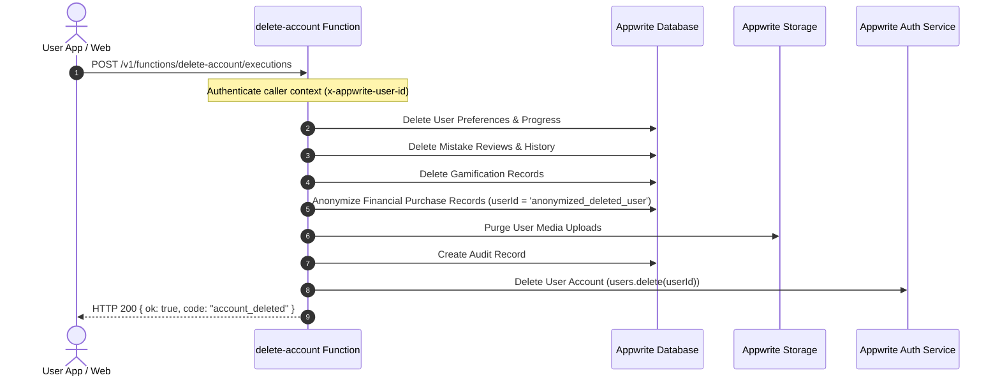

# Olitun Account & Data Deletion Policy

**Application ID:** `com.ol.itun`  
**Developer Contact:** `support@olitun.in`  
**Web Deletion Portal:** [https://kh3rwa1.github.io/delete-account.html](https://kh3rwa1.github.io/delete-account.html)

---

## 1. How to Request Account & Data Deletion

Users of Olitun can delete their account and associated personal data through two easy methods:

### Method 1: Instant In-App Deletion (Recommended)
You can permanently delete your account and all associated data directly inside the Olitun app at any time:
1. Open the **Olitun** app on your device.
2. Tap on your **Profile** tab, then tap the **Settings** gear icon.
3. Scroll down to the **Danger Zone** section.
4. Tap **Delete Account**.
5. Read the confirmation warning and tap **Delete**.
6. Your account, credentials, and all learning progress will be wiped immediately, and you will be signed out.

### Method 2: Web & Email Deletion Request
If you no longer have access to the mobile application, you can submit a manual deletion request:
1. Send an email to **[support@olitun.in](mailto:support@olitun.in)** from the email address associated with your Olitun account.
2. Use the Subject line: `Account Deletion Request - Olitun`.
3. State your registered email address and request the complete deletion of your account and personal data.
4. **Processing Timeline:** Manual requests are processed within **7 business days**. You will receive a confirmation email once the deletion is complete.

---

## 2. What Data Is Deleted?

Upon account deletion, the following data categories are **permanently removed**:
- **Authentication & Profile:** User ID, email, name, avatar preferences, and session tokens.
- **Learning Progress:** Lesson progress, streak history, quiz scores, and practice statistics.
- **Mistakes & Reviews:** Personal mistake history, spaced repetition schedules, and quiz attempt logs.
- **User Uploads & Storage:** Any personal audio recordings or media files stored in cloud storage.
- **Local Device Cache:** All cached data in local database boxes (Hive) is wiped.

---

## 3. What Data Is Retained & Retention Period

- **Financial & Purchase Records:** For tax, fiscal, and statutory accounting compliance, financial order IDs and transaction amounts are retained for statutory periods (up to 7 years). However, they are **fully anonymized** (`userId = 'anonymized_deleted_user'`) and stripped of any personal identifiers.
- **Security Audit Logs:** Pseudonymized cryptographic hashes of rate limiting events are auto-pruned after 2 hours.

---

## 4. Technical Deletion Architecture (Serverless Execution)

- The deletion function is **idempotent** and tolerates partial network retries.
- All Appwrite collections enforce strict user-isolated read/write access.

