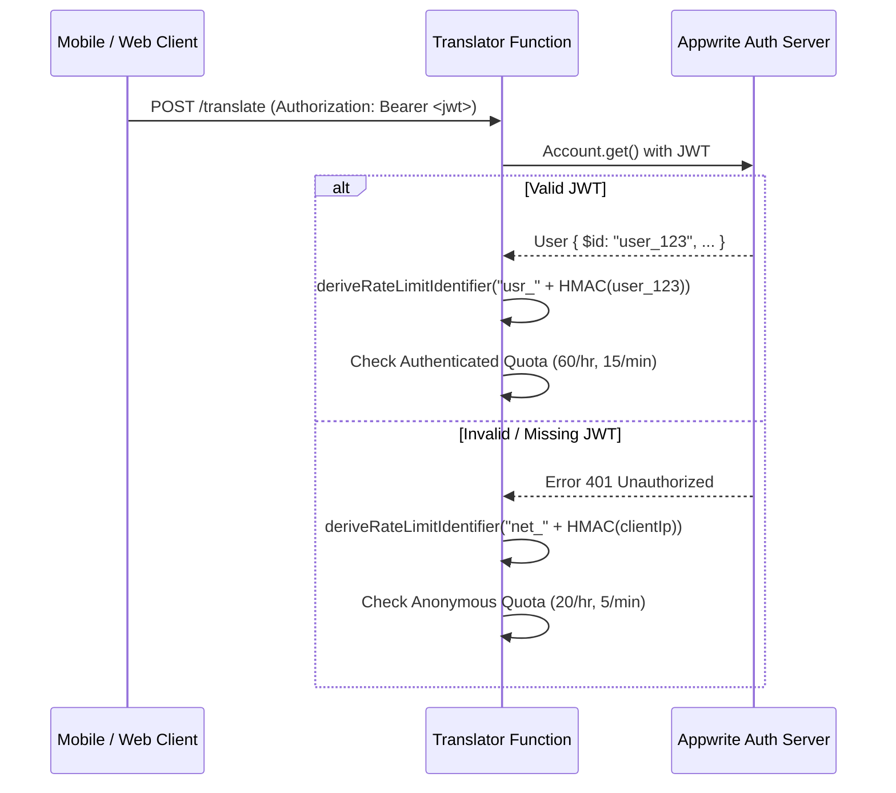

# Olitun Identity Trust Boundary & Cryptographic Verification

## 1. Zero-Trust Caller Headers

The Olitun backend functions never trust unverified client-provided identity headers.

### Prohibited Authentication Patterns:
- Accepting `x-appwrite-user-id` from HTTP request headers as authoritative.
- Accepting `userId` in JSON request payloads as authoritative.
- Defaulting to authenticated status based on client claims without cryptographic validation.

---

## 2. Cryptographic JWT Verification Flow

When a client makes an authenticated request:
1. The client supplies an Appwrite JWT via the `Authorization: Bearer <jwt>` header or `x-appwrite-jwt` header.
2. The function initializes an ephemeral Appwrite `Client` scoped solely with that JWT (`client.setJWT(jwt)`).
3. The function invokes `new Account(client).get()`.
4. Appwrite validates the cryptographic signature and token expiry on the server.
5. If `Account.get()` succeeds, the verified user ID is extracted (`user.$id`).
6. If `Account.get()` throws 401 or fails, the identity claim is discarded and the request is handled strictly under the anonymous tier with standard network rate limits.

---

## 3. Secret Management & Domain Separation

- **`RATE_LIMIT_SALT`:** Dedicated HMAC secret loaded strictly from environment variables.
  - In `production` environments (`NODE_ENV === 'production'`), the absence of `RATE_LIMIT_SALT` causes immediate fail-closed shutdown.
  - Development fallbacks are strictly barred in production environments.
- **Domain Separation:** Prevents collision between user identifiers and network identifiers by prepending distinct domain prefixes (`translator-rate-limit:user:v1:` vs `translator-rate-limit:network:v1:`).
