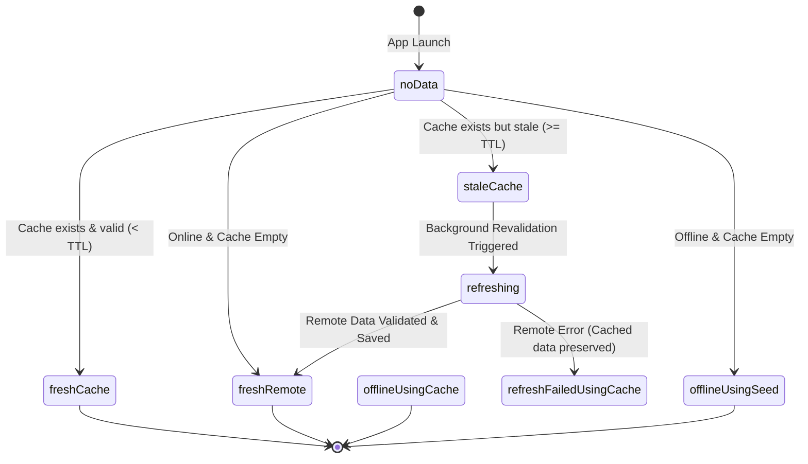

# Olitun Offline-First Architecture & Stale-While-Revalidate (SWR)

## 1. Overview

Olitun is built from the ground up as an offline-first learning platform for Ol Chiki and Santali language education. The architecture ensures that users in low-connectivity environments can immediately access lessons, quizzes, vocabulary, and rhymes without latency or blank loading spinners.

---

## 2. Typed Content Lifecycle States (`ContentState<T>`)

To eliminate ambiguity between loading, stale, cached, and offline data, content access is modeled using explicit typed states:

### State Matrix

| State Factory | Source | Freshness | Description |
| :--- | :--- | :--- | :--- |
| `ContentState.noData()` | `none` | `initial` | Initial state before local storage is queried. |
| `ContentState.freshCache(data)` | `localCache` | `fresh` | Returned synchronously when cached data is within TTL. |
| `ContentState.staleCache(data)` | `localCache` | `stale` | Returned immediately while background revalidation executes. |
| `ContentState.refreshing(data)` | `localCache` | `stale` | In-flight network request active; UI continues displaying cached content. |
| `ContentState.freshRemote(data)` | `remoteServer` | `fresh` | Fresh data fetched, validated, and committed to Hive cache. |
| `ContentState.offlineUsingCache(data)` | `localCache` | `stale` | Network unreachable; user continues learning from cache. |
| `ContentState.offlineUsingSeed(data)` | `bundleSeed` | `fresh` | Network unreachable and cache empty; bundled static seed lessons loaded. |
| `ContentState.refreshFailedUsingCache(data, failure)` | `localCache` | `failed` | Background refresh failed; non-blocking notification displayed while cached data remains interactive. |
| `ContentState.fatalNoData(failure)` | `none` | `failed` | No local data, no seed, and network request fatally failed. |

---

## 3. SWR Execution Workflow

1. **Immediate Cache Return:** On calling `getLessons()` or `getLessonsByCategory()`, local Hive storage is read synchronously. If cached models exist, they are returned to the caller immediately with zero blocking network calls.
2. **In-Flight Request Deduplication:** If multiple widgets or providers request the same category or dataset concurrently, the repository checks `_inFlightRefreshes[key]`. Only a single network request is dispatched; all callers share the in-flight `Future`.
3. **Payload Validation:** When remote payloads return, models are validated (non-empty IDs, required Santali/English titles) before being accepted. Invalid models are dropped to prevent cache corruption.
4. **Atomic Hive Write:** Validated models are saved to Hive in a single atomic batch (`cacheLessons()`).
5. **Static Seed Fallback:** If both network and persistent local cache are empty (e.g. fresh offline install), the repository falls back to embedded static seed lessons (`_staticSeedLessons`), ensuring the app is never empty.
