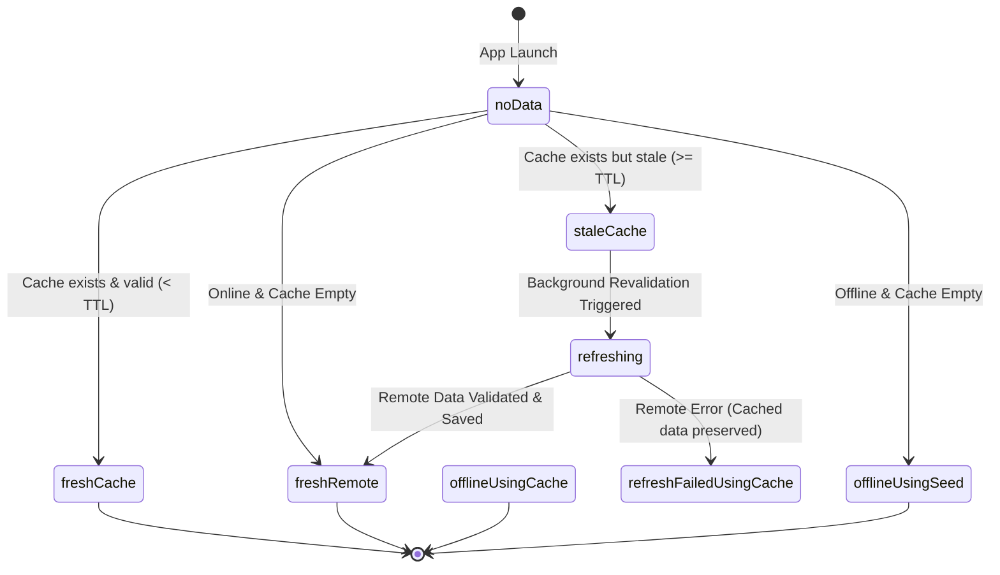

# Offline-First Architecture & Data Synchronization

## 1. Overview & Core Philosophy

Olitun is built from the ground up as an offline-first learning platform for Ol Chiki and Santali language education. The architecture guarantees that learners in rural or low-connectivity environments can immediately launch the app, read all previously downloaded lessons, complete quizzes, practice calligraphy, and accumulate learning stats indefinitely with zero latency and zero blank loading spinners.

```
┌─────────────────────────────────────────────────────────────┐
│                    Presentation Layer                       │
│      ConsumerWidget  <───  AsyncValue.when(data)            │
├─────────────────────────────────────────────────────────────┤
│                 State / Notifiers Layer                     │
│         CategoryNotifier / LessonNotifier / Stats           │
├─────────────────────────────────────────────────────────────┤
│                   Repository Layer (SWR)                    │
│      1. Yields Cached / Stale Data Immediately (<5ms)       │
│      2. Dispatches Background Async Refresh (if online)     │
│      3. Atomically Replaces Cache only on Valid Parse       │
├──────────────────────────────┬──────────────────────────────┤
│      Remote DataSource       │       Local DataSource       │
│        (Appwrite SDK)        │   (Hive Envelope Cache +     │
│                              │   Durable Mutation Outbox)   │
└──────────────────────────────┴──────────────────────────────┘
```

---

## 2. Typed Content Lifecycle States (`ContentState<T>`)

To eliminate ambiguity between loading, stale, cached, and offline data, content access is modeled using explicit typed states:



### State Matrix

| State Factory | Source | Freshness | User Experience & Description |
| :--- | :--- | :--- | :--- |
| `ContentState.noData()` | `none` | `initial` | Initial state before local storage is queried. |
| `ContentState.freshCache(data)` | `localCache` | `fresh` | Returned synchronously when cached data is within TTL (<5ms render). |
| `ContentState.staleCache(data)` | `localCache` | `stale` | Instant render of cached content; background revalidation dispatched. |
| `ContentState.refreshing(data)` | `localCache` | `stale` | Background network request in-flight; user continues learning uninterrupted. |
| `ContentState.freshRemote(data)` | `remoteServer` | `fresh` | Fresh data fetched, validated, and atomically committed to Hive cache. |
| `ContentState.offlineUsingCache(data)` | `localCache` | `stale` | Network unreachable; user continues learning from persistent cache. |
| `ContentState.offlineUsingSeed(data)` | `bundleSeed` | `fresh` | Fresh offline install with empty cache; bundled immutable static seed catalog loaded. |
| `ContentState.refreshFailedUsingCache(data, failure)` | `localCache` | `failed` | Background refresh failed; non-blocking offline hint while cached data remains interactive. |
| `ContentState.fatalNoData(failure)` | `none` | `failed` | No local data, no seed, and network request fatally failed. |

---

## 3. SWR Execution Workflow & Invariants

1. **Immediate Cache Return:** On calling any repository data method (e.g. `getLessons()`, `getLessonsByCategory()`), local Hive storage is read synchronously. Cached models are returned immediately with zero blocking network latency.
2. **In-Flight Request Deduplication:** When multiple widgets or providers request the same dataset concurrently, the repository deduplicates active queries via `_inFlightRefreshes[key]`. Only a single network request is dispatched; all callers share the in-flight `Future`.
3. **TTL Means Stale, Never Deleted:** A TTL indicates when background revalidation should be attempted. Valid learning content is **never** evicted simply because of age. A user opening Olitun after 30 days offline has immediate access to all previously downloaded content.
4. **Atomic Schema Invalidation:** Caches are versioned (`cacheSchemaVersion = 4`). Only breaking schema format migrations trigger controlled eviction.
5. **Corrupt Payload Defense:** When remote payloads return, models are validated before acceptance. If an Appwrite response contains malformed data or fails parsing, the repository discards the remote payload and **preserves the last-known-good cache**.
6. **Durable Mutation Outbox:** Progress mutations completed while offline (stars earned, lessons finished, letters practiced) are written to a dedicated durable Hive box (`MutationOutboxService`) and synced with exponential backoff + jitter upon connection recovery.

---

## 4. Conflict Resolution Rules (Cross-Device Sync)

When resolving progress between multiple devices or reconciling local offline progress with cloud state:

| Progress Metric | Resolution Strategy | Rationale |
|---|---|---|
| **Completed Lessons** | Set Union (`local ∪ remote`) | A lesson finished on any device remains permanently completed |
| **Completed Quizzes** | Set Union (`local ∪ remote`) | Quizzes completed anywhere are recognized |
| **Best Quiz Score** | Maximum (`max(local, remote)`) | Learner retains their highest recorded mastery score |
| **Stars / Rewards** | Monotonic Idempotent Accumulator | Rewards bound to unique event IDs (`evt_star_*`) to prevent duplication |
| **Learning Minutes** | Additive Delta Accumulation | Minutes spent learning offline on Device A and Device B are both preserved |
| **Current Streak** | UTC Date Activity Validation | Computed from active consecutive activity dates |
| **Longest Streak** | Maximum (`max(local, remote)`) | Preserves historical milestone |
