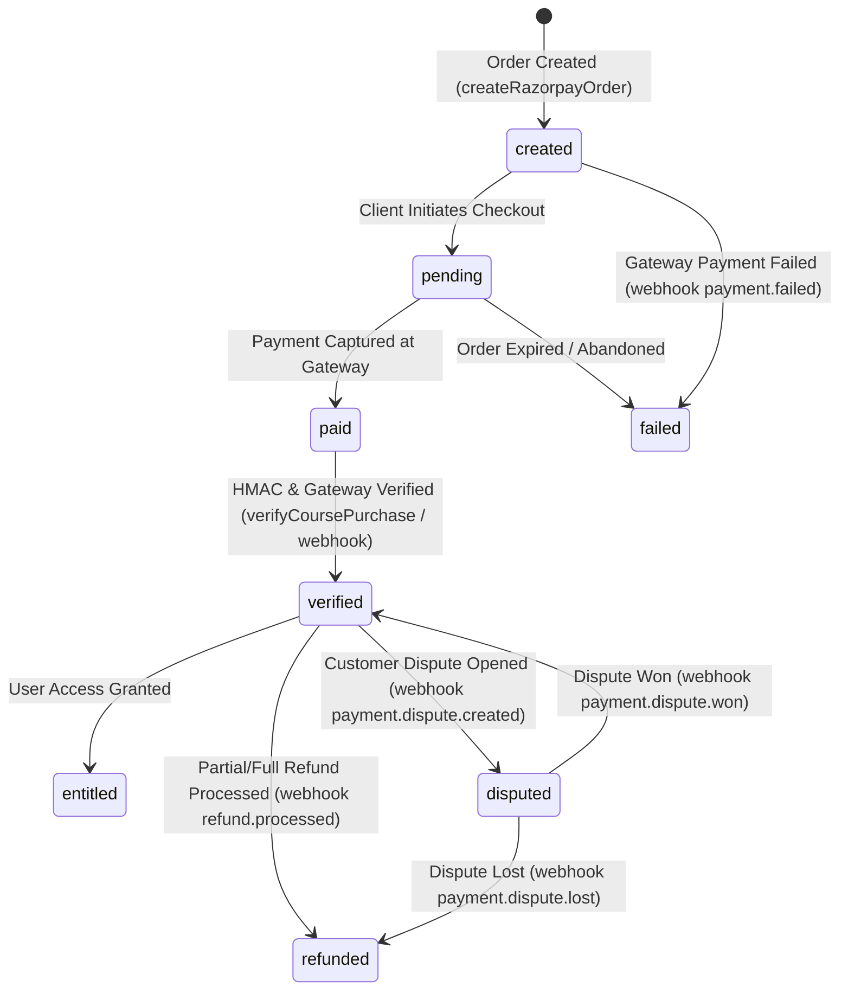

# Payment State Machine & Concurrency Control Architecture

This document describes the payment lifecycle, state machine transitions, signature verification, atomic locking, and dispute handling in Olitun.

---

## 1. Payment State Machine

---

## 2. Invariants & Security Principles

1. **Server-Authoritative Pricing & Entitlements**:
   - Course prices and unlock eligibility are fetched directly from the database by `createRazorpayOrder`. Client-supplied amounts are strictly ignored.
2. **HMAC Signature Verification**:
   - Webhook payloads (`x-razorpay-signature`) and client verification requests are validated using SHA-256 HMACs in constant-time comparison (`safeCompare`).
3. **Atomic Replay & Claim Protection**:
   - Payments use a two-phase claim (`payment_claims` collection) to prevent double-processing or replay attacks across concurrent threads.
4. **Epoch Lock & Monotonic Ledger Fencing**:
   - Webhook refund processing uses epoch lock records (`lock:payment:ID:epoch:N`) with a 60-second TTL to serialize concurrent refund events safely.
