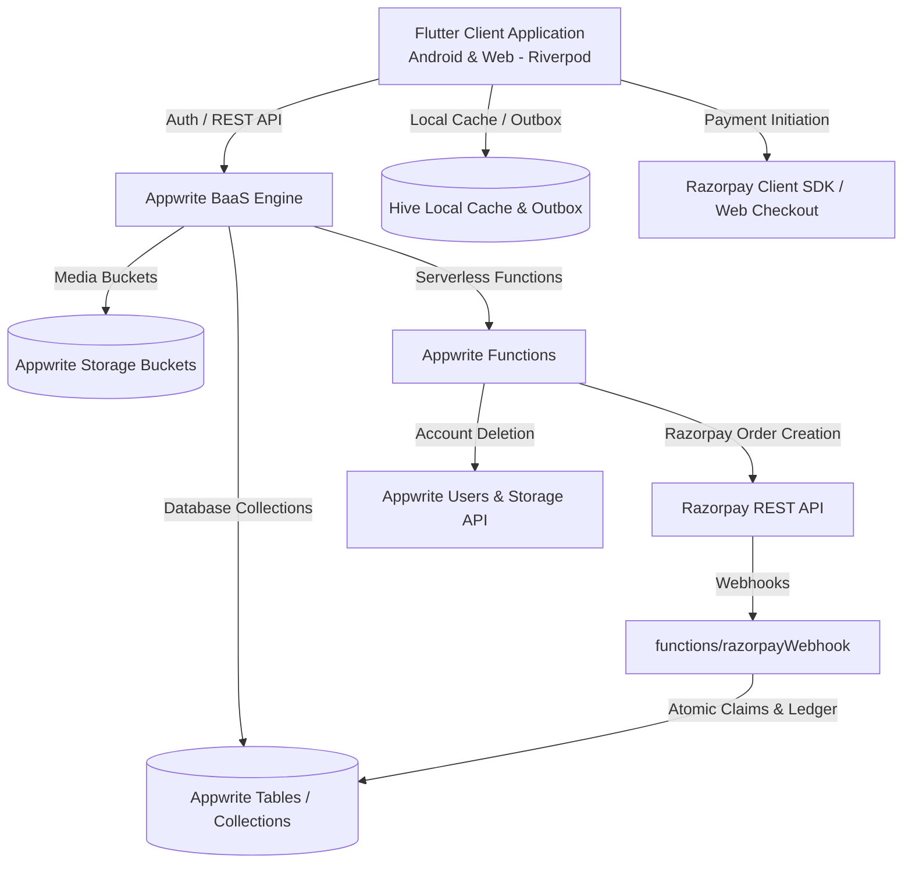

# Olitun Production Hardening Report (10/10 Baseline)

**Date**: August 9, 2026  
**Branch**: `hardening/production-10-of-10`  
**Repository**: `https://github.com/Kh3rwa1/olitunapp`

---

## 1. Executive Summary

Olitun is a Flutter application targeting Android and Web, designed for Santali/Ol Chiki language learning. It uses Appwrite as a backend-as-a-service (database, authentication, storage, serverless functions) and Razorpay for payment processing.

This document serves as the authoritative baseline, security audit, architecture map, data classification guide, and implementation log for bringing Olitun to a production-grade 10/10 level.

---

## 2. Architecture Map

### Modular Components
1. **Core Layer (`lib/core/`)**:
   - `api/`: Appwrite database service (`appwrite_db_service.dart`), AI service.
   - `auth/`: Authentication service, session management, user state (`appwrite_auth_service.dart`).
   - `offline/`: Mutation outbox (`mutation_outbox_service.dart`).
   - `storage/`: Hive cache service (`cache_service.dart`), Stale-While-Revalidate repository (`stale_while_revalidate_repository.dart`), Upload service (`upload_service.dart`).
   - `payments/`: Payment providers, purchase flow, state management (`payment_provider.dart`).
   - `logging/` & `observability/`: Sanitize logs (`app_logger.dart`), crash reporting (`crash_reporting.dart`).
   - `theme/` & `motion/`: Design tokens, Ol Chiki typography, responsive layouts.
2. **Feature Layer (`lib/features/`)**:
   - `auth/`: Email/password login, anonymous sign-in, OTP authentication.
   - `home/`: Learning dashboard, AI translator, category grid.
   - `learn/` & `lessons/`: Course categories, lesson blocks, sentence tracing, audio pronunciation, practice guides.
   - `quiz/`: Quiz generation, heart economy, scoring, mistake tracking.
   - `rhymes/` & `bakhed`: Audio rhymes, cultural literature, media player.
   - `profile/`: User stats, settings, account deletion UI, gamification progress.
   - `admin/`: Content management, category/lesson editing, analytics overview, maintenance tools.

---

## 3. Appwrite Infrastructure Map

### Collections & Storage Map

| Collection / Bucket ID | Target Purpose | Required Access Level | Current Permission Risk |
|---|---|---|---|
| `categories` | Lesson categories | Public Read / Admin Write | High (generic update overwrite) |
| `lessons` | Course content blocks | Public Read / Admin Write | High (generic update overwrite) |
| `words`, `sentences`, `letters`, `numbers` | Vocabulary & stroke data | Public Read / Admin Write | High (generic update overwrite) |
| `rhymes`, `bakhed_*` | Cultural literature & audio | Public Read / Admin Write | High (generic update overwrite) |
| `user_preferences` | User settings & progress | Owner-Private Read/Write | Critical (`Permission.read(Role.any())` default) |
| `user_mistakes` | Mistake review history | Owner-Private Read/Write | Critical (`Permission.read(Role.any())` default) |
| `user_badges`, `reward_events` | Gamification rewards | Owner-Private Read / Function Write | High (client direct creation) |
| `binti_guru_waitlist` | Premium waitlist entries | Function Write / Admin Read | Critical (public read exposure) |
| `course_purchases` | Validated purchase ledger | Function Write / Owner Read | Critical (must be function-only write) |
| `payment_claims` | Payment idempotency locks | Function-Only | Critical (public read exposure) |
| `refund_claims` | Dispute & refund claims | Function-Only | Critical (public read exposure) |
| `rate_limits` | Function rate limiting | Function-Only | High (client accessible) |
| `admin_audit_logs` | Server action audit log | Function-Only / Admin Read | Critical (public read exposure) |
| `media_uploads` (Bucket) | User & admin media files | Authenticated Read/Write | High (missing file size/type guard) |

---

## 4. Data Classification Table

| Data Classification | Applicable Models / Storage | Access Constraints | Retention Policy |
|---|---|---|---|
| **Public** | Lessons, Categories, Rhymes, Words, Sentences, App Settings | Readable by `Role.any()`, Writable by Admin/Function | Permanent |
| **Authenticated** | General media assets, badges definitions | Readable by `Role.users()` | Permanent |
| **Owner-Private** | User preferences, learning progress, mistake logs | Readable/Writable strictly by `Role.user(userId)` | Purged upon account deletion |
| **Admin-Only** | Analytics rollups, system maintenance, admin audit logs | Readable/Writable strictly by `Team:admin` / Function | Permanent audit retention |
| **Function-Only** | Payment claims, refund locks, rate limit counters | Readable/Writable strictly by Server API Key | Operationally managed |
| **Financial / Legal** | Razorpay purchase receipts, anonymized transaction ledgers | Server Function only; PII stripped on user deletion | 7 years (statutory requirement) |

---

## 5. Confirmed Baseline Risks & Findings

1. **[CRITICAL] Data Access Permission Exposure**:
   - `lib/core/api/appwrite_db_service.dart` forced `Permission.read(Role.any())` on all `createDocument` and `updateDocument` calls, making private user rows and ledger documents publicly readable.
2. **[CRITICAL] Account Deletion PII Leakage**:
   - `functions/delete-account/` accepted `userId` from client requests instead of extracting it from trusted execution context (`x-appwrite-user-id`), allowing unauthorized deletion calls.
3. **[HIGH] Payment Ledger Overwrites & Concurrent Claims**:
   - Multiple checkout attempts overwrote single pending records instead of creating immutable checkout attempt records.
4. **[HIGH] Mutation Outbox Expiration**:
   - `MutationOutboxService` stored outbox items using `CacheService.set` which defaults to a 24-hour TTL, causing offline user progress to disappear if offline for >24 hours.
5. **[MEDIUM] CI/CD Coupling with Staging Infrastructure**:
   - Staging connection failures on `main` halted PR builds and skipped web/Android compilation checks.

---

## 6. Baseline Verification Command Results

- **Dart Format**: PASS (`dart format --set-exit-if-changed .` - 0 files formatted)
- **Flutter Analyzer**: PASS (`flutter analyze --fatal-infos` - 0 issues found)
- **Flutter Unit Tests**: PASS (635 tests passed, 0 failed, 2 skipped)
- **Coverage Threshold**: PASS (77.9% critical coverage vs 65.0% threshold)
- **Node Backend Tests**: PASS (15/15 payment function tests passed)
- **Function Unit Tests**: PASS (25/25 function unit tests passed)
