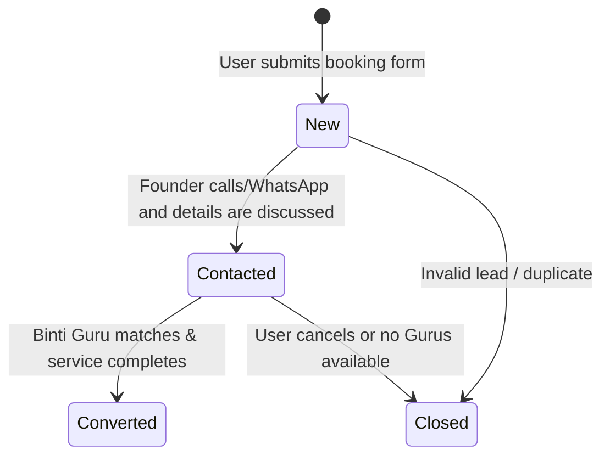

# Binti Guru Booking & Waitlist System

This document outlines the architecture, data models, and workflow processes for the Binti Guru Waitlist System.

## Overview

Olitun's Binti Guru Waitlist is a marketplace validation engine designed to measure demand for professional Santali recitation and ceremony leaders (**Binti Gurus**) before building out a full-fledged peer-to-peer booking marketplace.

---

## 1. Value Proposition & User Experience

A **Binti Guru** is a highly respected expert who performs sacred recitations, storytelling, and guides traditional Santali ceremonies (e.g., Karam, Sohrai, Baha, Weddings, Funerals).

### A. The User Flow
1. Users navigate to the **Bakhed** tab (bottom navigation).
2. A premium segmented selector allows switching between **Bakhed Audio** (traditional mantra audio library) and **Binti Guru** (booking services).
3. The **Binti Guru Landing Page** explains the service ("Book a Verified Binti Guru for your upcoming traditional ceremony").
4. Tapping "Join the Waitlist" opens a premium, smooth form sheet.
5. Users submit:
   - Full Name
   - Verified Indian Phone Number (`+91` 10-digit validation)
   - Ceremony Type (Karam, Sohrai, Baha, Wedding, Funeral, Naming, etc.)
   - Event Date (Optional)
   - Location (City & State)
   - Special Instructions/Notes
6. On submission, the record is written to Appwrite and immediately reflects in the user's **Profile → My Bookings** section.

---

## 2. Waitlist Data Model

### Appwrite Collection: `binti_guru_waitlist`

| Attribute | Type | Format/Values | Required | Description |
|---|---|---|---|---|
| `user_id` | string | `ID` (Appwrite user ID) | no | Links to registered users, or blank for guests. |
| `full_name` | string | Standard string | yes | Customer name. |
| `phone_number` | string | Regex `^[6-9]\d{9}$` | yes | 10-digit Indian phone number. |
| `ceremony_type` | enum | `karam`, `sohrai`, `baha`, `funeral`, `wedding`, `naming`, `other` | yes | Target ceremony. |
| `event_date` | datetime | ISO DateTime | no | Planned date of event. |
| `city` | string | Standard string | yes | Target city. |
| `state` | enum | `Jharkhand`, `West Bengal`, `Odisha`, `Bihar`, `Assam`, `Other` | yes | Target state. |
| `notes` | string | Up to 1000 characters | no | Custom instructions or details. |
| `submitted_at` | datetime | ISO DateTime | yes | Timestamp of submission. |
| `contacted_at` | datetime | ISO DateTime | no | Timestamp of manual founder outreach. |
| `status` | enum | `new`, `contacted`, `converted`, `closed` | yes | Operations workflow status (default `new`). |

---

## 3. Waitlist Operations Workflow

The admin panel features a dedicated "Binti Waitlist" board (`/admin/binti-waitlist`) with visual indicators, filters, and actionable workflow buttons.

### Manual Founder Outreach Sequence
Since we are pre-launch, the match-making is handled entirely manually by the Olitun founding team:
1. **Lead Alert:** The team monitors the `/admin/binti-waitlist` table for new (`new`) submissions.
2. **First Contact:** Tap the lead to view phone details. Use the built-in direct actions:
   - **Call Customer:** Launches phone dialer.
   - **WhatsApp Chat:** Opens WhatsApp prefilled with customer name and ceremony details.
3. **Status Update:** Mark lead as `contacted` within the CMS.
4. **Fulfillment:** Recruit a local traditional practitioner, coordinate dates, and close the deal.
5. **Success Capture:** Update status to `converted` on success, or `closed` on cancellation.

---

## 4. Future Marketplace Evolution

Once transaction volume and user density reach target metrics, the manual waitlist will be refactored into a automated marketplace:
* **Guru Registry:** Separate Appwrite collections for verified Gurus, including certificates, location radius, and dynamic pricing.
* **In-App Booking Engine:** Direct peer-to-peer chat, real-time availability calendar, and escrow payments.
* **Review & Rating System:** Customer feedback loop for Gurus to ensure high quality and authenticity.
