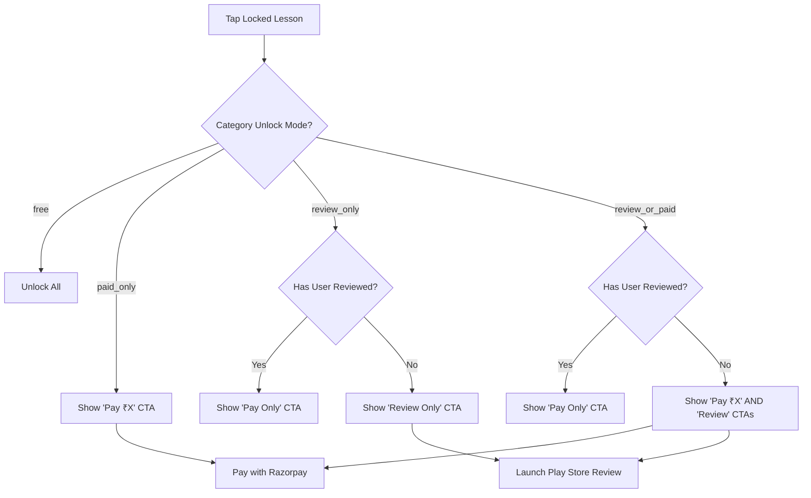

# Category Unlock Modes & Paywall System

This document outlines the architecture, business logic, and policy compliance guidelines for Olitun's course unlock system.

## Overview

Olitun transitions from a simple catalog to a monetized, value-driven education platform by transforming core categories into unlockable structured courses. Users can unlock courses through two options: direct payment or leaving a Google Play Store review.

---

## 1. Supported Unlock Modes

Each category in Olitun is assigned an `unlock_mode` enum value, managed dynamically via the Admin Panel CMS.

| Mode | Key | Description | Target Users |
|---|---|---|---|
| **Free** | `free` | Accessible to all users without any restriction. | Basic introductory material. |
| **Paid Only** | `paid_only` | Requires a direct payment via Razorpay. | Premium core curricula. |
| **Review or Paid** (Dual Unlock) | `review_or_paid` | User's choice: pay the premium fee **OR** leave a Play Store review. | High-quality standard courses. |
| **Review Only** | `review_only` | Unlocked solely by leaving a Play Store review. | Feedback-generation courses. |

---

## 2. Policy & Compliance Guidelines

To remain in full compliance with the **Google Play Store Developer Policies**, the application strictly implements the following rules:

### A. Non-Coercive Rating Requests
* **No Rating Requirement:** We **never** ask for a specific rating (e.g., "Give us 5 stars to unlock").
* **Feedback Focus:** All user prompts focus on "Leave feedback on the Play Store to help us improve".
* **System-Level API:** The mobile client delegates strictly to the official `in_app_review` platform API when available. This ensures the review sheet is sandboxed and governed entirely by Google Play's system behaviors, preventing arbitrary intercepting.

### B. One-Review-Unlock-Per-User Enforcement
* Since a user can only review an app on the Google Play Store once, the backend enforces a **maximum of one review-based course unlock per user account**.
* Subsequent attempts to unlock courses using the review method will verify against the database. If a review unlock has already been utilized by the user, the "Unlock via Review" option is dynamically hidden from all paywalls, requiring payment instead.
* The backend Appwrite Function (`verifyCoursePurchase`) checks for existing waitlist/unlock records of type `play_store_review` before authorizing the transaction.

---

## 3. Paywall Architecture

### A. Preview Lesson Gatekeeping
For locked categories (`paid_only`, `review_or_paid`, `review_only`), the first `N` lessons (defined by `preview_lesson_count` on the category model) are marked as **Preview** and remain completely free to play.
All lessons beyond the preview threshold display a lock overlay (`🔒`). Tapping a locked lesson invokes the **Glassmorphic Paywall Bottom Sheet**.

### B. Dynamic CTA State Diagram
The `PaywallBottomSheet` dynamically reads the global state and user history:

---

## 4. Founder Operations & Override Controls

### A. Global Review Kill-Switch
If Google Play implements stricter enforcement or if we decide to suspend review-based unlocks, the Admin can toggle the **Global Review Unlock** setting off in the Admin settings panel.
* When disabled, the mobile app automatically degrades all `review_or_paid` categories to act as `paid_only`, and hides the review CTA entirely.

### B. Preview and Pricing Adjustments
Founders can easily adjust course pricing (`price_inr`) and the preview gate (`preview_lesson_count`) per category without deploying new client code or restarting the app. Changes reflect instantly on the next page load.
